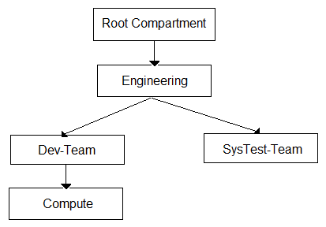
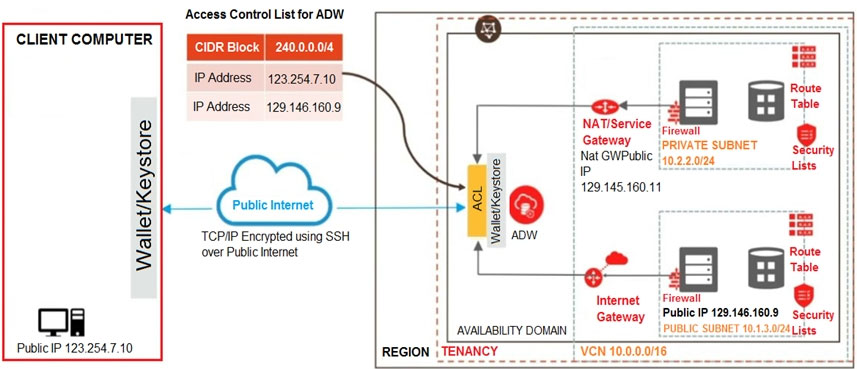
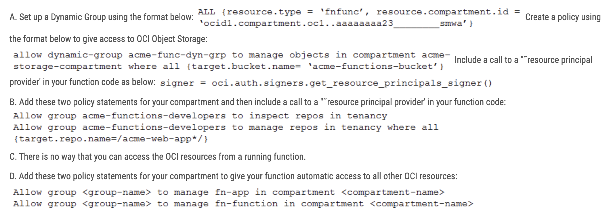
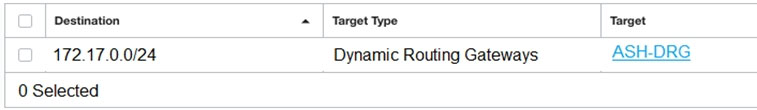
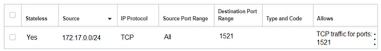
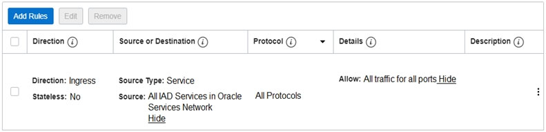
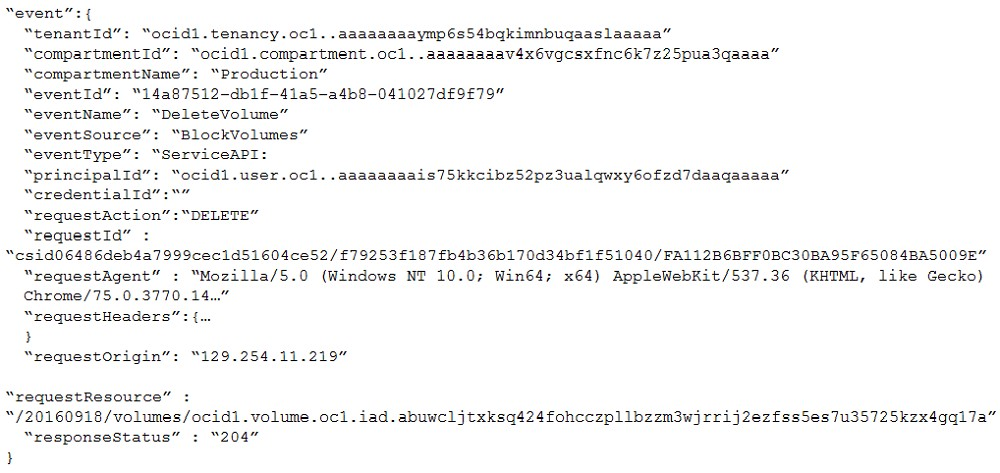
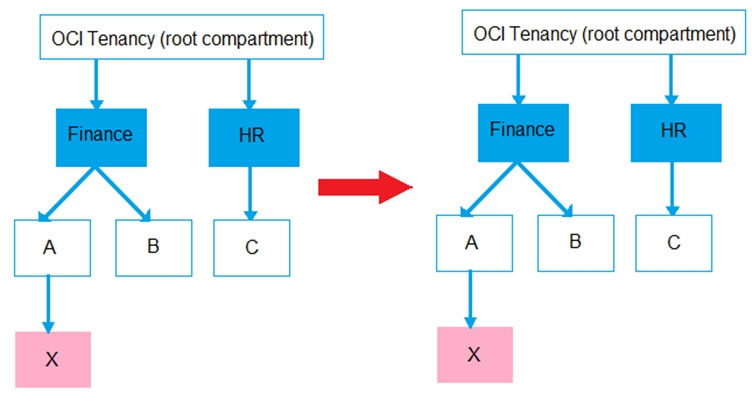
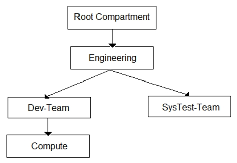
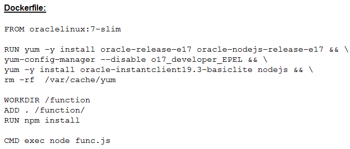

# Oracle Cloud Infrastructure - Architect Professional

####  Question 1 
Which three scenarios are suitable for the use of Oracle Cloud Infrastructure (OCI) Autonomous Transaction Processing "" Serverless (ATP-S) deployment?
(Choose three.)
```
A. A manufacturing company is running Oracle E-Business Suite application on-premises. They are looking to move this application to OCI and they want to use 
   a managed database offering for their database tier.  
B. A midsize company is considering migrating its legacy on-premises MongoDB database to Oracle Cloud Infrastructure (OCI). The database has significantly 
   higher workloads on weekends than weekdays.  
C. A small startup is deploying a new application for eCommerce and it requires a database to store customers' transactions. The team is unsure of what the 
   load will look like since it is a new application.  
D. A well-established, online auction marketplace is running an application where there is database usage 24x7, but also has peaks of activity that are hard to predict.
   When the peaks happen, the total activities may reach 3 times the normal activity level.  
E. A developer working on an internal project needs to use a database during work hours but doesn't need it during nights or weekends. 
   The project budget requires her to keep costs low.
```
<span class="hidden">C,D,E : "A small startup", "well-established", "developer working"</span>


####  Question 2 
You are the Solution Architect that designed this Oracle Cloud Infrastructure (OCI) compartment layout for your organization:  
  
The development team has deployed quite a few instances under "˜Compute' Compartment and the operations team needs to list the instances under the same compartment for their testing. Both teams, development and operations are part of a group called "˜Eng-group'.
You have been looking for an option to allow the operations team to list the instances without access any confidential information or metadata of the resources.
Which IAM policy should you write based on these requirements? (Choose the best answer.)  
```
A. Allow group Eng-group to inspect instance-family in compartment Dev-Team:Compute and attach the policy to "˜SysTest-Team' Compartment.  
B. Allow group Eng-group to read instance-family in compartment Dev-Team:Compute and attach the policy to "˜Dev-Team' Compartment.  
C. Allow group Eng-group to inspect instance-family in compartment Dev-Team:Compute and attach the policy to "˜Engineering' Compartment.  
D. Allow group Eng-group to read instance-family in compartment Compute and attach the policy to "˜Engineering' Compartment.  
```
<span class="hidden">C : "Dev-Team:Compute, Engineering"</span>


####  Question 3
You are working for a Travel company and your travel portal application is a collection of microservices that run on Oracle Cloud Infrastructure Container Engine for Kubernetes. 
As per the recent security overview, you have noticed that Oracle has published a newer image of the Operating System used by the worker nodes. 
You want to make sure that your application doesn't face any downtime but at the same time the worker nodes gets upgraded to the latest version of the Operating System.
What should you do to get this upgrade done without application downtime? (Choose the best answer.)  
```
A. 1. Shutdown the worker nodes 2. Create a new node pool 3. Manually schedule the pods on the newly built node pool  
B. 1. Create a new node pool using the latest available Operating System image. 2. Run kubectl cordon <node name> against all the worker nodes in the old pool to stop any new application pods to get scheduled 3. Run kubectl drain <node name> """"delete""local""data """"force """"ignore""daemonsets to evict any Pods that are running 4. Delete the old node pool  
C. 1. Create a new node pool using the latest available Operating System image 2. Run kubectl taint nodes """"all node""role.kubernetes.io/master"" 3. Delete the old node pool  
D. 1. Run kubectl cordon <node name> against all the worker nodes in the old pool to stop any new application pods to get scheduled 2. Run kubectl drain <node name> """"delete""local""data """"force """"ignore""daemonsets to evict any Pods that are running 3. Download the patches for the new Operating System image 4. Patch the worker nodes to the latest Operating System image    
```
<span class="hidden">B : "4. Delete the old node pool"</span>


####  Question 4
You work for a large bank where security and compliance are critical. As part of the security overview meeting, your company decided to minimize the installation of local tools on your laptop. You have been running Ansible and kubectl to spin up Oracle Container Engine for Kubernetes (OKE) clusters and deployed your application.
For authentication, you are using an Oracle Cloud Infrastructure (OCI) CLI config file that contains OCIDs, Fingerprint, and a locally stored PEM file. Your security team doesn't want you to store any local API key and certificate, or any other local tools.
Which two actions should you perform to spin up the OKE cluster and interact with it? (Choose two.)  
```
A. Create a developer workstation on OCI. Install Ansible and kubectl on it. Use resource principal to authenticate against OCI API and create the OKE Cluster.  
B. Develop your own code using OCI SDK to deploy the OKE cluster.  
C. Work on OCI Cloud Shell to use built-in Ansible and kubectl to deploy the OKE cluster. Use OCI_CLI_AUTH=instance_obo_user environment variable to authenticate using built-in token.  
D. Work on OCI Cloud Shell to use built-in Ansible and kubectl to deploy the OKE cluster. Bring in your own config file and certificate to authenticate against OCI API.  
E. Create a developer workstation on OCI. Install Ansible and kubectl on it. Use instance principal to authenticate against OCI API and create the OKE Cluster.  
```
<span class="hidden">C,E : "OCI_CLI_AUTH" , "Use instance principal"</span>


####  Question 5
A new international hacktivist group, based in London, launched wide scale cyber attacks including SQL Injection and Cross-Site Scripting (XSS) across multiple websites  
which are hosted in Oracle Cloud Infrastructure (OCI). As an IT consultant, you must configure a Web Application Firewall (WAF) to protect these websites against the attacks.
How should you configure your WAF to protect the website against those attacks? (Choose the best answer.)  
```
A. Enable a Protection Rule to block the attacks based on HTTP Headers that contain XSS and SQL strings.  
B. Enable an Access Rule to block the IP Address range from London.  
C. Enable a Protection Rule to block requests XSS Filters Categories and SQL Filters Categories.  
D. Enable a Protection Rule to block requests that came from London.  
E. Enable an Access Rule that contains XSS Filters Categories and SQL Filters Categories.  
```
<span class="hidden">
C. Enable a Protection Rule to block requests XSS Filters Categories and SQL Filters Categories.  
</span>


####  Question 6
You work for a public health care company based in the United States. Their existing patient records system runs in an on-premise data center and the customer is sending tape backups offsite as part of their disaster recovery planning.
You developed an alternative archival solution using Oracle Cloud Infrastructure (OCI) that will save the company a significant amount of money on a yearly basis.  
The solution involves storing data in an OCI Object Storage bucket. After reviewing your solution with the customer Global Risk and Compliance (GRC) team, they highlighted four security requirements:
```
✑ All data less than 1 year old must be accessible within 2 hours
✑ All data must be retained for at least 10 years and be accessible within 48 hours
✑ All data must be encrypted at rest
✑ No data may be transmitted across the public internet
```
Which two options meet the requirements outlined by the customer GRC team? (Choose two.)
```
A. Provision a FastConnect link to the closest OCI region and configure a private peering virtual circuit.  
B. Provision a FastConnect link to the closest OCI region and configure a public peering virtual circuit.  
C. Create an OCI Object Storage Standard tier bucket. Configure a lifecycle policy to archive any object that is older than 365 days.  
D. Create an OCI Object Storage Standard tier bucket. Configure a lifecycle policy to delete any object that is older than 7 years.  
E. Create a VPN connection between your on-premises data center and OCI. Create a Virtual Cloud Network (VCN) along with an OCI Service Gateway for OCI Object Storage.  
```
<span class="hidden">
B. Provision a FastConnect link to the closest OCI region and configure a public peering virtual circuit. 
C. ~ Configure a lifecycle policy to archive any object that is older than 365 days. 
</span>


####  Question 7
You are helping a customer troubleshoot a problem. The customer has several Oracle Linux servers in a private subnet within a Virtual Cloud Network (VCN). The servers are configured to periodically communicate to the Internet to get security patches for applications installed on them.
The servers are unable to reach the internet. An Internet Gateway has been deployed in the public subnet in the VCN and the appropriate routes are configured in the Route Table associated with the public subnet.
Based on cost considerations, which option will fix this issue? (Choose the best answer)
```
A. Create a NAT gateway in the VCN and configure the NAT gateway as the route target for the private subnet.  

B. Create another Internet Gateway and configure it as route target for the private subnet.  

C. Create a Public Load Balancer in front of the servers and add the servers to the Backend Set of the Public Load Balancer.  

D. Implement a NAT instance in the public subnet of the VCN and configure the NAT instance as the route target for the private subnet.  
```
<span class="hidden">
C. Create a Public Load Balancer in front of the servers
</span>


####  Question 8
Multiple departments in your company use a shared Oracle Cloud Infrastructure (OCI) tenancy to implement their projects. You are in charge of managing the cost of OCI resources in the tenancy and need to obtain better insights into department's usage.
Which three options can you implement together to accomplish this? (Choose three.)
```
A. Create a budget that matches your commitment amount and an alert at 100 percent of the forecast.  
B. Set up a tag default that automatically applies tags to all specified resources created in a compartment. Then use these tags for cost analysis.  
C. Set up different compartments for each department. Then track and analyze cost per compartment.  
D. Use the billing cost tracking report to analyze costs.  
E. Set up a consolidated budget-tracking tags to analyze costs in a granular manner.  
```
<span class="hidden">A,B,C : "Create a budget", "Set up a tag", "Set up different"</span>


####  Question 9
After performing maintenance on an Oracle Linux compute instance the system is returned to a running state. You attempt to connect using SSH but are unable to do so. You decide to create an instance console connection to troubleshoot the issue.
Which three tasks would enable you to connect to the console connection and begin troubleshooting? (Choose three.)
```
A. Stop the compute instance using the Oracle Cloud Infrastructure (OCI) Command Line Interface (CLI).  
B. Reboot the compute instance using the Oracle Cloud Infrastructure (OCI) Management Console.  
C. Edit the Linux boot menu to enable access to console.  
D. Upload an API signing key for console connection authentication.  
E. Use SSH to connect to the public IP address of the compute instance and provide the console connection OCID as the username.  
F. Use SSH to connect to the service endpoint of the console connection service.  
```
<span class="hidden">B,C,F : "Reboot the compute instance", "Edit the Linux boot menu", "Use SSH to connect to the service endpoint"</span>


####  Question 10
You designed and deployed your Autonomous Data Warehouse (ADW) so that it is accessible from your on-premise data center and servers running on both private and public networks in Oracle Cloud Infrastructure (OCI).  
  

As you are testing the connectivity to your ADW database from the different access paths, you notice that the server running on the private network is unable to connect to ADW.
Which two steps do you need to take to enable connectivity from the server on the private network to ADW? (Choose two.) 
```
A. Add an entry in the Security List of the ADW allowing ingress traffic for CIDR block 10.2.2.0/24  
B. Add an entry in the route table (associated with the private subnet) with destination of 0.0.0.0/0; target type of NAT Gateway, add a stateful egress rule to the security list (associated with the private subnet) with destination of 0.0.0.0/0 and for all IP protocols.  
C. Add an entry in the access control list of ADW for IP address 129.146.160.11  
D. Add an entry in the route table (associated with the private subnet) with destination of 0.0.0.0/0; target type of Internet Gateway, add a stateful egress rule to the security list (associated with the private subnet) with destination of 0.0.0.0/0 and for all IP protocols.  
E. Add an entry in the access control list of ADW for CIDR block 10.2.2.0/24.  
```
<span class="hidden">B,C : "route table ... target type of NAT Gateway", "ADW for IP address 129.146.160.11"</span>


####  Question 11
An Oracle Cloud Infrastructure (OCI) Public Load Balancer's SSL certificate is expiring soon. You noticed the Load Balancer is configured with SSL Termination only. When the certificate expires, data traffic can be interrupted and security compromised.
What steps do you need to take to prevent this situation? (Choose the best answer.)  
```
A. Add the new SSL certificate to the Load Balancer and update backend servers to use the new certificate bundle.
B. Add the new SSL certificate to the Load Balancer and update listeners to use the new certificate bundle.
C. Add the new SSL certificate to the Load Balancer, update listeners and backend sets so they can use the new certificate bundle.
D. Add the new SSL certificate to the Load Balancer, update backend servers to work with a new certificate and edit listeners so they can use the new certificate bundle.
E. Add the new SSL certificate to the Load Balancer and implement end to end SSL so it can encrypt the traffic from clients all the way to the backend servers.
```
<span class="hidden">B. Add the new SSL certificate to the Load Balancer and update listeners to use the new certificate bundle.</span>


####  Question 12
Your company will soon start moving critical systems into Oracle Cloud Infrastructure (OCI) platform. These systems will reside in the us-phoenix-1 and us- ashburn-1 regions. As part of the migration planning, you are reviewing the company's existing security policies and written guidelines for the OCI platform usage within the company.
Your security processes for critical systems require that all data is encrypted at rest using Customer-Managed Keys.
Which two options ensure compliance with this policy? (Choose two.)  
```
A. You do not need to perform any additional actions because the OCI Block Volume service always encrypts all block volumes, boot volumes, and volume backups at rest by using the Advanced Encryption Standard (AES) algorithm with 256-bit encryption.  
B. When you create a new OCI Object Storage bucket through OCI console, you need to choose "ENCRYPT USING CUSTOMER-MANAGED KEYS" option.  
C. When you create a new block volume through OCI console, select "Encrypt using Customer-Managed Keys" checkbox and use encryption keys generated and stored in OCI Vault.  
D. When you create a new compute instance through OCI console, you use the default options for "configure boot volume" to speed up the process to create this compute instance.  
E. When you create a new compute instance through OCI console, you use the default shape to speed up the process to create this compute instance.  
```
<span class="hidden">
B, C : "ENCRYPT USING CUSTOMER-MANAGED KEYS"
</span>


####  Question 13
A hospital in Austin has hosted its web-based medical records portal entirely in Oracle Cloud Infrastructure (OCI) using compute instances for its web-tier and DB
System database for its data tier. To validate compliance with Health Insurance Portability and Accountability (HIPAA), the hospital hired an IT security professional to check their systems.
It was found that there were a lot of unauthorized requests coming from a set of IP addresses originating from a county in Southeast Asia.
Which option can mitigate this type of attack? (Choose the best answer.)  
```
A. Block the attacking IP addresses by creating a Security List rule to deny access to the subnet where the web server is running.  
B. Block the attacking IP addresses by creating a Network Security Group rule to deny access to the compute instance where the web server is running.  
C. Implementing an OCI Web Application Firewall Bot Management policy to identify the attacking IP addresses and mitigate the threat.  
D. Block the attacking IP addresses by implementing an OCI Web Application Firewall policy using Access Control Rules.  
```
<span class="hidden">
D : implementing an OCI Web Application Firewall policy using Access Control Rules
</span>


####  Question 14
You work for a large bank where your main application is a payment processing gateway API. You deployed the application on Oracle Container Engine for
Kubernetes (OKE) and used API Gateway with several policies to control the access of the API endpoint.
However, your customers are complaining about the unavailability of the API endpoint. Upon checking, you noticed that the Gateway URL is throwing Service
Unavailable error. You need to check the backend latency and backend responses when this error started last night.
What should you do to get this data? (Choose the best answer.)  

```
A. Check with the application owner and search the log file for the container to get the metrics from the log file.

B. Go to Governance Menu and click on Audit to see the Audit log for the API Gateway. Filter it using Start and End date with a 503 response status.

C. Go to Developer Services and click on API Gateway. Go to the detail page of the gateway and select Metrics. Change the Start and End time to filter the metrics.

D. Go to Monitoring and click on Service Metrics. Choose the Metric Namespace as oci_apigateway. Change the Start and End time accordingly. 
Add a Dimension and select httpStatusCode: 503. Check the backend latency and backend responses metric.
```
<span class="hidden">
D : "Go to Monitoring and click on Service Metric"
</span>


####  Question 15
You are running a legacy application in a compute instance on Oracle Cloud Infrastructure (OCI). To provide enough space for it to store internal data, a block volume is attached to the instance in paravirtualized mode.
Your application is not resilient to crash-consistent backup.
What should you do to backup the block volume in a secure and cost effective way? (Choose the best answer.)  

```
A. Save your application data, detach the block volume and create a clone.  
B. Create a volume group, add the boot volume and then run the volume group backup.  
C. Create a backup, detach the block volume and save your application data.  
D. Save your application data, detach the block volume and create a backup.  
```
<span class="hidden">
D : "Save your application data ... create a backup"
</span>


####  Question 16
You work as a solutions architect for an online retail store creating a portal to allow the users to pay for their groceries using credit cards. Since the application is not fully compliant with the Payment Card Industry Data Security Standard (PCI DSS), your company is looking to use a third-party payment service to process credit card payments.
The third-party service allows a maximum of 5 public IP addresses at a time. However, your website is using Oracle Cloud Infrastructure (OCI) Instance Pool Auto
Scaling policy to create up to 15 instances during peak traffic demand, which are launched in VCN private subnets and attached to an OCI public Load Balancer.
Upon user payment, the portal connects to the payment service over the Internet to complete the transaction
What solution can you implement to make sure that all 15 compute instances can connect to the third party system to process the payments during peak traffic demand? (Choose the best answer.)

```
A. Route credit card payment request from the compute instances through the NAT Gateway. On the third-party services, whitelist the public IP associated with the NAT Gateway.

B. Create an OCI Command Line Interface (CLI) script to automatically reserve public IP address for the compute instances. On the third-party services, whitelist the Reserved public IP.

C. Whitelist the Internet Gateway Public IP on the third party service and route all payment requests through the Internet Gateway.

D. Route payment request from the compute instances through the OCI Load Balancer, which will then be routed to the third party service.
```
<span class="hidden">
D. Route payment request from the compute instances
</span>


####  Question 17
You are developing a Serverless function for your company's IoT project. This function should access Oracle Cloud Infrastructure (OCI) Object Storage to store some files. 
You choose Oracle Functions to deploy this function on OCI. However, your security team doesn't allow you to carry any API Token or RSA Key to authenticate the function against the OCI API to access the Object Storage.
What should you do to get this function to access OCI Object Storage without carrying any static authentication files? (Choose the best answer.)    
  
<span class="hidden">
A : "Set up a Dynamic Group"
</span>


####  Question 18
You work for a retail company and they developed a Microservices based shopping application that needs to access Oracle Autonomous Database from the application. As an Architect, you have been tasked to treat all of the application components as Kubernetes native objects, such as the microservices, Oracle
Autonomous database, Kubernetes services, etc.
What should you do to make sure that you can use Kubernetes constructs to manage the life cycle of the application components, including Oracle Autonomous
Database? (Choose the best answer.)
```
A. Create an Oracle Cloud Infrastructure (OCI) Service Gateway and connect to the Oracle Autonomous Database using the private IP address from the microservice.
B. Provision an Oracle Autonomous Database and then use OCI Service Broker to access the database as a native component to your Kubernetes cluster.
C. Create a service from the Kubernetes cluster and point to the Oracle Autonomous Database using its FQDN.
D. Install and secure the OCI Service Broker for Kubernetes. Then provision and bind to the required Oracle Cloud Infrastructure services.
```
<span class="hidden">
D : "Install and secure the OCI Service Broker"
</span>


####  Question 19
A large London based eCommerce company is running Oracle DB Systems Virtual Machine RAC database on Oracle Cloud Infrastructure (OCI) for their eCommerce application in the uk-london-1 region. They are currently taking automatic backups of the database, as configured during the database provisioning activity. They are launching a new product soon, which is expected to sell in large quantities all over the world.
The application architecture should have minimal cost, no data loss, no performance impacts during the database backup windows and should have minimal downtime.
What is the most efficient and cost-effective mechanism of modifying the database deployment architecture to meet these application goals? (Choose the best answer.)
```
A. Launch a new VM RAC database in another availability domain, launch a compute instance, deploy Oracle GoldenGate on it and then configure it to replicate the data from the eCommerce Database over to the new VM RAC database using GoldenGate. Take backups from the new VM RAC database.
B. Turn off automatic backups from the eCommerce database, implement Oracle Active Data Guard with the standby database deployed on another availability domain, and take backups from the standby database.
C. Launch a new VM RAC database in another availability domain, launch a compute instance, deploy Oracle GoldenGate on it and then configure bi-directional replication from the eCommerce Database over to the new VM RAC database using GoldenDate. Take backup from the new VM RAC database.
D. Turn off automatic backups from the eCommerce database, implement Oracle Data Guard with the standby database deployed on another availability domain, take backups from the standby database.
```
<span class="hidden">
B : "Oracle Active Data Guard" "Turn off automatic backups"
</span>


####  Question 20
Your organization is using Oracle Cloud Infrastructure (OCI) and wants to setup a disaster recovery plan by copying block volume backups to another region at regular intervals. This makes it easier to rebuild applications and data in the destination region if a region wide disaster occurs in the source region.
Which IAM Policy statement allows the VolumeAdmins group to copy volume backups between regions? (Choose the best answer.)
```
A. Allow group VolumeAdmins to inspect volumes""family in tenancy
B. Allow group VolumeAdmins to use backups in tenancy
C. Allow group VolumrAdmins to manage volumes in tenancy
D. Allow group VolumeAdmins to copy volume""backups in tenancy
```
<span class="hidden">
B. Allow group VolumeAdmins to use backups in tenancy
</span>


####  Question 21
You have multiple IAM users who launch different types of compute instances and block volumes every day. As a result, your Oracle Cloud Infrastructure (OCI) tenancy quickly hit the service limit and you can no longer create any new instances. As you are cleaning up the environment, you notice that the majority of the instances and block volumes are untagged. Therefore, it is difficult to pinpoint the owner of these resources and verify if they are safe to terminate.
Because of this, your company has issued a new mandate, which requires adding a predefined set of tags to identify owners before launching compute instances.
Which option is the simplest way to implement this new requirement? (Choose the best answer.)
```
A. Create tag variables to automatically tag a resource with the user name.
B. Create a policy to automatically tag a resource with the user name.
C. Create a policy using IAM requiring users to tag specific resources. This will allow a user to launch compute instances only if certain tags were defined.
D. Create tag variables for each compartment to automatically tag a resource with the user name.
E. Create a default tag for each compartment, which ensures that appropriate tags are applied at resource creation.
```
<span class="hidden">
A. Create tag variables to automatically tag a resource with the user name.
</span>


####  Question 22
You have an Oracle database system in a virtual cloud network (VCN) that needs to be accessible on port 1521 from your on-premises network CIDR
172.17.0.0/24.
You have the following configuration currently:
```
✑ Virtual cloud network (VCN) is associated with a Dynamic Routing Gateway (DRG), and DRG has an active IPSec connection with your on-premises data center.
✑ Oracle database system is hosted in a private subnet.
✑ The private subnet route table has following configuration.
```
  
✑ The private subnet security list has following INGRESS security rule.  
  
✑ The Oracle database system is part of a network security group with following security rules.  
  
However, you are still unable to connect to the Oracle Database system.  
Which action will resolve this issue? (Choose the best answer.)  
```
A. Add an EGRESS rule in private subnet security list as following.
B. Add an EGRESS rule in network security group as following.
C. Add a route rule in the private subnet route table as following.
D. Add an Egress rule in private subnet security list as following.
```
<span class="hidden">
B. Add an EGRESS rule in network security group as following.
</span>
 


####  Question 23
A retail company runs their online shopping platform entirely on Oracle Cloud Infrastructure (OCI). This is a 3-tier web application that includes a 100 Mbps Load
Balancer, Virtual Machine Instances for web and application tiers, and an Oracle DB Systems Virtual Machine. Due to unprecedented growth, they noticed an increase in the incoming traffic to their website and all users start getting 503 (Service Unavailable) errors.
What is the potential problem in this scenario? (Choose the best answer.)
```
A. You did not configure a Service Gateway to allow connection between web servers and Load Balancer.
B. The Traffic Management Policy is not set to Load Balancer the traffic to the web servers.
C. The Load Balancer health check status indicates critical situation for half of the backend web servers.
D. The Database is down hence users cannot access the web site.
E. All the web servers are too busy and not able to answer any request from users.
```
<span class="hidden">
E. All the web servers are too busy and not able to answer any request from users.
</span>


####  Question 24
An automobile company wants to deploy their CRM application for Oracle Database on Oracle Cloud Infrastructure (OCI) DB Systems for one of its major clients.
In compliance with the business continuity program of the client, they need to provide a Recovery Point Objective (RPO) of 24 hours and a Recovery Time
Objective (RTO) of 1 hour. The CRM application should be available even in the event that an entire OCI Region is down.  
Which approach meets these requirements in the most cost effective manner? (Choose the best answer.)
```
A. Deploy a 1 node VM Oracle database in one region. Manually Configure a Recovery Manager (RMAN) database backup schedule to take hourly database backups. 
   Asynchronously copy the database backups to object storage in another OCI region. If the primary OCI region is unavailable, launch a new 1 node VM Database 
   in the other OCI region and restore the production database from the backup.
B. Deploy a 1 node VM Oracle database in one region and replicate the database to a 1 node VM Oracle database in another region using a manual setup 
   and configuration of Oracle Data Guard.
C. Deploy an Autonomous Transaction Processing database in one region and replicate it to an Autonomous Transaction Processing database 
   in another region using Oracle GoldenGate.
D. Deploy a 2 node Virtual Machine (VM) Oracle RAC database in one region and replicate the database to a 2 node VM Oracle RAC database 
    in another region using a manual setup and configuration of Oracle Data Guard.
```
<span class="hidden">
B. Deploy a 1 node VM Oracle database in one region and replicate the database  ... "Oracle Data Guard"
</span>


####  Question 25
Your team is conducting a root cause analysis (RCA) following a recent, unplanned outage. One of the block volumes attached to your production WebLogic server was deleted 
and you have been tasked with identifying the source of the action. You search the Audit logs and find several Delete actions that occurred in the previous 24 hours. 
Given the sample excerpt of this event:  
  
Which item from the event log helps you identify the individual or service that initiated the DeleteVolume API call? (Choose the best answer.)
```
A. eventId
B. requestAgent
C. eventource
D. requestOrigin
E. principalId
```
<span class="hidden">
E : "principalId"
</span>


####  Question 26
You are responsible for migrating your on-premises legacy databases on 11.2.0.4 version to Autonomous Transaction Processing "" Dedicated (ATP""D) in Oracle
Cloud Infrastructure (OCI). As a solution architect, you need to plan your migration approach.  
Which two options do you need to implement together to migrate your on-premises databases to OCI? (Choose two.)  
```
A. Use Oracle GoldenGate replication to keep on-premises database online during migration.
B. Convert on-premises databases to PDB, upgrade to 19c, and encrypt.
C. Use Oracle Data Guard to keep on-premises database always active during migration.
D. Retain changes to Oracle shipped privileges, stored procedures or views in the on-premises databases.
E. Retain all legacy structures and unsupported features (e.g. legacy LOBs) in the on-premises databases for migration.
```
<span class="hidden">
A. Use Oracle GoldenGate replication to keep on-premises database online during migration.<br>
B. Convert on-premises databases to PDB, upgrade to 19c, and encrypt.
</span>


####  Question 27
An online stock trading application is deployed to multiple Availability Domains in the us-phoenix-1 region. Considering the high volume of financial transactions that the trading application handles, the company has hired you to ensure that the data stored by the application is scalable, highly-available, and disaster resilient.
In the event of failure, the Recovery Time Objective (RTO) must be less than 2 hours to meet regulatory compliance requirements.  
Which Disaster Recovery strategy should be used to achieve the RTO requirement in the event of system failure? (Choose the best answer.)
```
A. Configure your application to use synchronous master-slave data replication between Availability Domains.
B. Configure hourly block volumes backups through the Storage Gateway service.
C. Store hourly block volumes backup to NVME device under a compute instance and generate a custom image every 5 minutes.
D. Configure hourly block volumes backups using the Oracle Cloud Infrastructure (OCI) Command Line Interface (CLI).
```
<span class="hidden">
D. Configure hourly block volumes backups using the Oracle Cloud Infrastructure (OCI) Command Line Interface (CLI).
</span>


####  Question 28
An organization has its IT infrastructure in a hybrid setup with an on-premises environment and an Oracle Cloud Infrastructure (OCI) Virtual Cloud Network (VCN) in the us-phoenix-1 region.  
The on-premises applications communicate with compute instances inside the VCN over a hardware VPN connection. They are looking to implement an Intrusion Detection and Prevention (IDS/IPS)  
system for their OCI environment. This platform should have the ability to scale to thousands of compute instances running inside the VCN.  
How should they architect their solution on OCI to achieve this goal? (Choose the best answer.)

```
A. Set up an OCI Private Load Balancer and configure IDS/IPS related health checks at TCP and/or HTTP level to inspect traffic.
B. Configure autoscaling on a compute instance pool and set vNIC to promiscuous mode to collect traffic across the VCN and send it to the IDS/IPS platform for inspection.
C. Configure each host with an agent that collects all network traffic and sends that traffic to the IDS/IPS platform for inspection.
D. There is no need to implement an IPS/IDS system as traffic coming over IPSec VPN tunnels is already encrypted.
```
<span class="hidden">
B : "Configure autoscaling on a compute instance pool and set vNIC"
</span>


####  Question 29
You work for a bank as the lead Oracle Cloud Infrastructure architect. You designed a highly scalable solution for your company's banking application. The architecture includes a load balancer, 
application servers with autoscaling configuration based on CPU utilization, and an Autonomous Database with Transaction Processing workload type running in a Virtual Cloud Network (VCN).
During the peak utilization period, the application users complain that the application runs slow.
What are two possible reasons for the application running slow at times? (Choose two.)
```
A. The VCN does not have a Network Security Group configured to allow traffic from the load balancer to all the application servers in the backend set.
B. Instance pool in autoscaling configuration for the application servers did not scale out due to compartment quota breach of the VM shapes used by the application servers.
C. The load balancer is not configured correctly to send traffic to all the listeners of the application servers in the backend set.
D. Instance pool in autoscaling configuration for the Autonomous Database did not scale out due to misconfigured scaling policy.
E. Instance pool in autoscaling configuration for the application servers did not scale out due to service limit breach of the VM shapes used by the application servers.
```
<span class="hidden">
B. ~ application servers did not scale out due to compartment quota 
D. ~ the Autonomous Database did not scale out due to misconfigured scaling policy.
</span>


####  Question 30
You are working as a solution architect with a global automotive provider who is looking to create a multi-cloud solution. They want to run their application tier in
Microsoft Azure while utilizing the Oracle DB Systems in the Oracle Cloud Infrastructure (OCI).  
What is the most-fault tolerant and secure solution for this customer? (Choose the best answer.)
```
A. Deploy the Oracle database system into a public subnet in your VCN and assign a public IP address. Connect your application tier running in Azure to the public IP 
   address of the database system over the internet.
B. Create a FastConnect virtual circuit with Microsoft Azure as the provider to establish a private interconnect between the application tier running in the Azure 
   Virtual Network and the OCI VCN that contains the Oracle Databases.
C. Create an encrypted, Virtual Private Network connection between the Microsoft Azure Virtual Network that contains the application tier and the OCI Virtual Cloud Network (VCN) 
   that contains the Oracle Databases.
D. Use an OCI Virtual Cloud Network remote peering connection to create a remote network connection between the application tier running in Microsoft Azure Virtual Network 
   and Oracle Databases running in the OCI Virtual Cloud Network (VCN).
```
<span class="hidden">
B. Create a FastConnect virtual circuit with Microsoft Azure as the provider to establish
</span>


####  Question 31
You are designing the network infrastructure for two application servers: appserver-1 and appserver-2 running in two different subnets inside the same Virtual  
Cloud Network (VCN) in Oracle Cloud Infrastructure (OCI). You have a requirement where your end users will access appserver-1 from the internet and appserver-2 from the on-premises network. The on-premises network is connected to your VCN over a FastConnect virtual circuit.  
How should you design your routing configuration to meet these requirements? (Choose the best answer.)
```
A. Configure a single routing table (Route Table-1) that has two sets of rules: one that has route to internet via the Internet Gateway and another that propagates specific routes 
   for the on-premise network via Dynamic Routing Gateway (DRG). Associate the routing table with the VCN.
B. Configure two routing tables: Route Table-1 that has a route to internet via the Internet gateway. Associate this route table to the subnet containing appserver- 1. 
   Route Table-2 that propagate specific routes for the on-premises network via the Dynamic Routing Gateway (DRG). Associate this route table to subnet containing appserver-2.
C. Configure a single routing table (Route Table-1) that has two sets of rules. One that has route to internet via the Internet Gateway and another that propagates specific routes 
   for the on-premise network via the Dynamic Routing Gateway. Associate the routing table with all the VCN subnets.
D. Configure two routing tables (Route Table-1 & Route Table-2) that have rule to route all traffic via the Dynamic Routing Gateway (DRG). Associate the two routing tables with all the VCN subnets.
```
<span class="hidden">
B: "Configure two routing tables: Route Table-1 that has a route to internet via the Internet gateway." "the Internet gateway. 마침표가 있는 것"
</span>


####  Question 32
An online registration system is currently hosted on one large Oracle Cloud Infrastructure (OCI) Bare metal compute instance with attached block volumes to store all of the users' data.
The registration system accepts the information from the user, including documents and photos and then performs automated verification and processing to check is the user is eligible for registration.  
The registration system becomes unavailable at times, when there is a surge of users using the system. The existing architecture needs improvement as it takes a long time for the system 
to complete the processing and the attached block volumes are not large enough to store the ever growing data being uploaded by the users.  
Which is the most effective option to achieve a highly scalable solution? (Choose the best answer.)  
```
A. Upgrade your architecture to use a pool of Bare metal servers and configure them to use their local SSDs for faster data access. Set up Oracle Streaming Service (OSS) to distribute 
   the tasks to the pool of Bare metal instances with Auto Scaling to dynamically increase or decrease the pool of compute instances depending on the length of the Streaming queue.
B. Change your architecture to use an OCI Object Storage standard tier bucket; replace the single bare metal instance with an Oracle Streaming Service (OSS) to ingest 
   the incoming requests and distribute the tasks to a group of compute instances with Auto Scaling.
C. Attach more Block volumes as the data volume increases, use Oracle Notification Service (ONS) to distribute tasks to a pool of compute instances working in parallel, 
   and Auto Scaling to dynamically size the pool of instances depending on the number of notifications received from the Notification Service. Use Resource Manager stacks 
   to replicate your architecture to another region.
D. Upgrade your architecture to use more Block volumes as the data volume increases. Replace the single bare metal instance with a group of compute instances with 
   Auto Scaling to dynamically increase or decrease the compute instance pools depending on the traffic.
```
<span class="hidden">
D: "Upgrade your architecture to use more Block volumes"
</span>


####  Question 33
Your customer recently provisioned a 1-Gbps FastConnect connection in ap-tokyo-1 region of Oracle Cloud Infrastructure (OCI). They will use this to connect to one Virtual Cloud Network (VCN) 
in their production OCI tenancy compartment and another VCN in their development OCI tenancy.  
How should you configure the connectivity between on-premises and the two VCNs in OCI using the single FastConnect connection? (Choose the best answer.)  
```
A. Provision a Dynamic Routing Gateway (DRG) and create a private virtual circuit for the FastConnect connection. Create one additional route table in your production VCN that includes two routes rules. One with a destination of the on-premises network using the DRG, and a second with a destination of the development VCN, also using the DRG.
B. Create two private virtual circuits on the FastConnect link. Create two Dynamic Routing Gateways, one for each VCNs. Attach the virtual circuits to the dynamic routing gateways.
C. Create a hub-VCN that uses DRG to communicate with the on-premises network over FastConnect. Connect the hub-VCN to the production VCN spoke and with development VCN spoke, each peered via their respective Local Peering Gateway (LPG).
D. Create a single private virtual circuit over FastConnect and attach Fastconnect to either of the VCN's DRG. Use Remote Peering to peer production and development VCNs.
```
<span class="hidden">
C : "Create a hub-VCN"
</span>


####  Question 34
All three Data Guard configurations are fully supported on Oracle Cloud Infrastructure (OCI). You want to deploy a maximum availability architecture (MAA) for database workload.
Which option should you consider while designing your Data Guard configuration to ensure best RTO and RPO without causing any data loss? (Choose the best answer.)
```
A. Configure "Maximum Availability" mode in SYNC mode between two availability domains (same region), and use the Maximum Availability mode in ASYNC mode between two regions.
B. Configure "Maximum Protection" mode which provides zero data loss if the primary database fails.
C. Configure "Maximum Scalability" mode which provides the highest level of scalability without compromising the availability of the primary database.
D. Configure "Maximum Performance" mode in SYNC mode between two availability domains (same region) which provides the highest level of data protection 
   that is possible without affecting the performance of the primary database.
```
<span class="hidden">
A : "Configure "Maximum Availability"
</span>


####  Question 35
As a part of a migration exercise for an existing on-premises application to Oracle Cloud Infrastructure (OCI), you are required to transfer a 7 TB file to OCI Object
Storage. You have decided to upload it using the multipart upload functionality of Object Storage.  
Which two statements are true? (Choose two.) 
```
A. It is possible to split this file into multiple parts using rclone tool provided by Object Storage.
B. Contiguous numbers need to be assigned for each part so that Object Storage constructs the object by ordering part numbers in ascending order.
C. After initiating a multipart upload by making a CreateMultiPartUpload REST API Call, the upload remains active until you explicitly commit it or about it.
D. It is possible to split this file into multiple parts using the APIs provided by Object Storage.
E. Active multipart upload can be checked by listing all parts that have been uploaded, however it is not possible to list information for an individual object part in an active multipart upload.
```  
<span class="hidden">
C. After initiating <br>
E. Active multipart upload can 
</span>


####  Question 36
You are advising the database administrator responsible for managing non-production environment for Oracle Autonomous Database running on Oracle Cloud
Infrastructure. You need to help the database administrator ensure that the non-production environments have a copy of the current data from the production environment in a manner 
that is most time-efficient.  
Which method should you recommend? (Choose the best answer.)  
```
A. Take a full database backup of the production Autonomous database and create the non-production database from it.
B. Create a metadata clone of the production Autonomous Database and create the non-production database from it.
C. Create a full clone of the production Autonomous Database and create the non-production database from it.
D. Take a Data Pump export of the production Autonomous database and import into the non-production database.
```
<span class="hidden">
C : "Create a full clone of the production Autonomous" 
</span>


####  Question 37
Your customer went through a recent departmental re-structure. As part of this change, they are organizing their Oracle Cloud Infrastructure (OCI) compartment structure to align with the company's new organizational structure.
They made the following change:  
Compartment x is moved, and its parent compartment is now compartment c.  
  
Policy defined in compartment A: Allow group networkadmins to manage subnets in compartment X
Policy defined in root compartment: Allow group admins to read subnets in compartment Finance:A:X
After you move the compartment, which two IAM policies would be required to ensure both groups retain the same permissions to compartment X that they had before? (Choose two.)
```
A. Define a policy in the root compartment as follows: Allow group admins to manage subnets in compartment Finance:A:X
B. Define a policy in compartment HR as follows: Allow group networkadmins to manage subnets in compartment C:X.
C. Define a policy in the root compartment as follows: Allow group admins to read subnets in compartment HR:C:X
D. Define a policy in compartment C as follows: Allow group networkadmins to read subnets in compartment X
```
<span class="hidden">
B. Define a policy in compartment HR as follows
C. compartment HR:C:X  "HR" 키워드를 찾으면 됨 
</span>


####  Question 38
A company has an urgent requirement to migrate 300 TB of data to Oracle Cloud Infrastructure (OCI) in two weeks. Their data center has been recently struck by a massive hurricane
and the building has been badly damaged, although still operational. They have a 100 Mbps Internet line but the connection is intermittent due to the damages caused to the electrical grid.  
In this scenario, what is the most effective service to use to migrate the data to OCI given the time constraints? (Choose the best answer.)  
```
A. Use multiple OCI Data Transfer Appliances to transfer data to OCI.
B. Setup an OCI Storage Gateway to connect your data center and your VCN. Once the connection has been established, upload all data to OCI.
C. Setup a hybrid network by launching a 1Gbps FastConnect virtual circuit between your data center and OCI. Use OCI Object Storage multipart upload tool to automate the migration of your data to OCI.
D. Setup an OCI Storage Gateway to connect your data center and your VCN. Once the connection has been established, upload all data to OCI using OCI Storage Gateway Cloud Sync tool.
E. Upload the data to OCI using OCI Object Storage multipart upload tool.
```
<span class="hidden">
A. Use multiple OCI Data Transfer Appliances to transfer data to OCI.
</span>


####  Question 39
You are working as a solutions architect for an online retail store in Frankfurt which uses multiple compute instance VMs spread among three availability domains in the eu-frankfurt-1 region.   
You noticed the website is having very high traffic, so you enabled autoscaling to suffice the needs of your application but, you observed that one of the availability domains is not receiving any traffic.  
What could be wrong in this situation? (Choose the best answer.)  
```
A. Autoscaling only works with single availability domains.
B. You forgot to attach a load balancer to your instance pool configuration.
C. You have to manually add all three availability domains to your load balancer configuration.
D. Autoscaling is using an Instance Pool configured to create instances in two availability Domains.
E. Autoscaling can be enabled for multiple availability domains only in uk-london-1 region.****
```
<span class="hidden">
D : "Autoscaling is using an Instance Pool configured"
</span>


####  Question 40
A retail company has recently adopted a hybrid architecture. They have the following requirements for their end-to-end connectivity model between their on- premises data center 
and Oracle Cloud Infrastructure (OCI) region.  
✑ Highly available connection with service level redundancy  
✑ Dedicated network bandwidth with low latency  
Which connectivity setup is the most cost-effective solution for this scenario? (Choose the best answer.)  
```
A. Setup FastConnect virtual circuit as your primary connection, and an IPSec VPN as a backup connection. Use separate edge devices in your on-premises data center for each connection.
 From your edge devices, advertise more specific routes through FastConnect virtual circuit, and less specific routes through the backup IPSec VPN path.

B. Setup IPSec VPN as your primary connection, and a FastConnect virtual circuit as a backup connection. Use separate edge devices in your on-premises data center for each connection. 
 From your edge devices, advertise more specific routes through IPSec VPN, and less specific routes through the backup FastConnect virtual circuit.

C. Setup FastConnect virtual circuit as your primary connection, and a second FastConnect virtual circuit as a backup connection. Make sure your FastConnect physical connectivity 
 is redundant. Use a single edge device in your on-premises data center for each connection. From your edge device, advertise more specific routes via primary FastConnect 
 virtual circuit, and less specific routes through the backup FastConnect virtual circuit.

D. Setup IPSec VPN as your primary connection, and a second IPSec VPN as a backup connection. Use separate edge devices in your on-premises data center for each connection.
 From your edge devices, advertise more specific routes via primary IPSec VPN, and less specific routes through the backup IPSec VPN.
```
<span class="hidden">
A. Setup FastConnect virtual circuit as your primary connection, and an IPSec VPN as a backup connection.
</span>


####  Question 41
A global retailer is setting up the cloud architecture to be deployed in Oracle Cloud Infrastructure (OCI) which will have thousands of users from two major geographical regions:
North America and Asia Pacific. The requirements of the services are:  
✑ Service needs to be available 24/7 to avoid any business disruption  
✑ North American customers should be served by application running in North American regions  
✑ Asia Pacific customers should be served by applications running in Asia Pacific regions  
✑ Must be resilient enough to handle the outage of an entire OCI region  
To meet this requirement, you have deployed your OCI resources to multiple OCI Regions.  
Which solution will deliver traffic with the lowest latency and provide fault tolerance? (Choose the best answer.)  
```
A. OCI DNS, Traffic Management with Geolocation steering policy
B. OCI, DNS, Traffic Management with Failover steering policy
C. OCI, DNS, Traffic Management with Load Balancer steering policy, Health Checks
D. OCI DNS, Traffic Management with Geolocation steering policy, Health Checks
```
<span class="hidden">
D. OCI DNS, Traffic Management with Geolocation steering policy, Health Checks
</span>


####  Question 42
You are a solutions architect for a global health care company which has numerous data centers around the globe. Due to the ever growing data that your company is storing, you were instructed  
to set up a durable, cost-effective solution to archive your data from your existing on-premises tape-based backup infrastructure to Oracle Cloud Infrastructure (OCI).  
What is the most-effective mechanism to implement this requirement? (Choose the best answer.)  
```
A. Use the File Storage Service in OCI and copy the data from your existing tape-based backup to the shared file system.
B. Setup an on-premises OCI Storage Gateway which will back up your data to OCI Object Storage Standard tier. Use Object Storage life cycle policy management to 
move any data older than 30 days from Standard to Archive tier.
C. Setup FastConnect to connect your on-premises network to your OCI VCN and use rsync tool to copy your data to OCI Object Storage Archive tier.
D. Setup an on-premises OCI Storage Gateway which will back up your data to OCI Object Storage Standard tier.
E. Setup an on-premises OCI Storage Gateway which will back up your data to OCI Object Storage Archive tier.
```
<span class="hidden">
E : "Setup an on-premises OCI Storage Gateway which will back up your data to OCI Object Storage Archive tier"
</span>


####  Question 43
A digital marketing company is planning to host a website on Oracle Cloud Infrastructure (OCI) and leverage OCI Container Engine for Kubernetes (OKE). 
This web server will make API calls to access OCI Object Storage to store all images uploaded by users.  
For security purposes, your manager instructed you to ensure that the credentials used by the web server to allow access to OCI Object Storage are not stored locally   
on the compute instance.  
What solution results in an implementation with the least effort for this scenario? (Choose the best answer.)  
```
A. Configure the credentials using OCI Registry (OCIR) which will automatically connect with OKE allowing the web server to make API calls to OCI Object Storage.
B. Configure the credentials using Instance Principal to allow the web server to make API calls to OCI Object Storage.
C. Configure the credentials using OCI Key Management to allow an instance to make API calls and grant access to OCI Object Storage.
D. Configure the credentials to use Transparent Data Encryption (TDE) which will automatically allow the web server to make API calls to OCI Object Storage.
```
<span class="hidden">
B. Configure the credentials using Instance Principal
</span>


####  Question 44
You are tasked with building a highly available, fault tolerant web application for your current employer. The security team is concerned about an increase in malicious 
web-based attacks across the internet and asked what you can do to add a higher level of security to the website.  
How should you architect the solution on Oracle Cloud Infrastructure (OCI) to meet all requirements defined by your organization? (Choose the best answer.)  
```
A. Deploy at least 3 web application servers, each in a different fault domain, using a regional private subnet. Place a public load balancer in a regional public subnet 
and create a backend set for all of the web application servers. Deploy a Web Application Firewall (WAF) and configure the load balancer public IP address as the origin.

B. Deploy at least 3 web application servers, each in a different fault domain, using a regional private subnet. Place a public load balancer in a regional public subnet 
and create a backend set for all of the web application servers. Create a Geolocation steering policy in Traffic Management and add an answer pool that directs 
to the public IP address of the load balancer. Configure a global catch-all rule to use this answer pool.

C. Deploy at least 3 web application servers, each in a different fault domain, using a regional public subnet. Ensure that each web application server is assigned a public 
IP address. Deploy a Web Application Firewall (WAF) and configure one Origin for each public IP address.

D. Deploy at least 3 web application servers, each in a different fault domain, using a regional public subnet. Use the OCI Traffic Management service to create a load 
balancing policy that will resolve DNS evenly between all web servers.
```
<span class="hidden">
A. ~  Deploy a Web Application Firewall (WAF) and configure the load balancer public IP address as the origin. 
</span>


####  Question 45
Given this compartment structure:  
  
You are managing a compute instance that currently resides in the Compute compartment. The Virtual Cloud Network (VCN) into which the compute instance was originally deployed, 
also resides in this compartment. To support a project-related task, you need to move just the compute instance to the SysTest-Team compartment. You log into your  
Oracle Cloud Infrastructure (OCI) account and use the Move Resource option to place the compute instance in the new compartment.  
What will be the result of your attempt to move the compute instance to the new compartment? (Choose the best answer.)  
```
A. The move will be successful. The compute instance's public and private IP addresses will stay the same. 
The compute instance will remain associated with the VCN from the source compartment.

B. The move will fail and you will be prompted to move the VCN first. Once VCN is moved to the target compartment, the compute instance can be moved.

C. After moving the compute instance, you must move the compute instance VNIC as a separate action. 
The public and private IP addresses of the instance will remain unchanged and it will still be associated with the VCN from the source compartment.

D. The move will be successful. However, the compute instance's public and private IP addresses will change, 
and it will be associated to the first VCN that was created in the new, target compartment.
```
<span class="hidden">
C : "After moving the compute instance" 
</span>


####  Question 46
A civil engineering company is running an online portal in which engineers can upload their constructions photos, videos, and other digital files.  
There is a new requirement for you to implement: the online portal must offload the digital content to an Object Storage bucket for a period of 72 hours.   
After the provided time limit has elapsed, the portal will hold all the digital content locally and wait for the next offload period.  
Which option fulfills this requirement? (Choose the best answer.)  
```
A. Create a pre-authenticated URL for the entire Object Storage bucket to read and list the content with an expiration of 72 hours.
B. Create a Dynamic Group with matching rule for the portal compute instance and grant access to the Object Storage bucket for 72 hours.
C. Create a pre-authenticated URL for the entire Object Storage bucket to write content with an expiration of 72 hours.
D. Create a pre-authenticated URL for each object that is uploaded to the Object Storage bucket with an expiration of 72 hours.
```
<span class="hidden">
C. Create a pre-authenticated URL for the entire Object Storage bucket to write content
</span>


####  Question 47
To serve web traffic for a popular product, your cloud engineer has provisioned four BM.Standard2.52 instances, evenly spread across two availability domains   
in the us-ashburn-1 region; LoadBalancer is used to deliver the traffic across instances.  
After several months, the product grows even more popular and you need additional compute capacity. As a result, an engineer provisioned two additional  
VM.Standard2.8 instances.  
You register the two VM.Standard2.8 instances with your Load Balancer Backend set and quickly find that the VM.Standard2.8 instances are now running at  
100% of CPU utilization but the BM.Standard2.52 instances have significant CPU capacity that's unused.  
Which option is the most cost effective and uses instances capacity most effectively? (Choose the best answer.)  
```
A. Configure Autoscaling instance pool with LoadBalancer to add up to 3 more BM.Standard2.52 instances when triggered. Shut off VM.Standard2.8 instances.
B. Configure LoadBalancer with two VM.Standard2.8 instances and use Autoscaling instance pool to add up to two additional VM.Standard2.8 instances.
   Shut off BM.Standard2.52 instances.
C. Route traffic to BM.Standard2.52 and VM.Standard2.8 instances directly using DNS and Health Checks. Shut off the Load Balancer.
D. Configure your Load Balancer with weighted round robin policy to distribute traffic to the compute instances, with more weight assigned to bare metal instances.
```
<span class="hidden">
D. Configure your Load Balancer with weighted round robin policy
</span>


####  Question 48
A large financial company has a web application hosted in their on-premises data center. They are migrating their application to Oracle Cloud Infrastructure (OCI) and require no downtime while the migration is on-going. 
In order to achieve this, they have decided to divert only 30% of the traffic to the new application running in OCI and keep the rest 70% traffic to their on-premises infrastructure. 
Once the migration is complete and application works fine, they will divert all traffic to OCI.  
As a solution architect working with this customer, which suggestion should you provide them? (Choose the best answer.)  
```
A. Use OCI Traffic management with Failover steering policy and distribute the traffic between OCI and on-premises infrastructure.
B. Use an OCI Load Balancer and distribute the traffic between OCI and on-premises infrastructure.
C. Use VPN connectivity between on-premises infrastructure and OCI, and create routing tables to distribute the traffic between them.
D. Use OCI Traffic management with Load Balancing steering policy and distribute the traffic between OCI and on-premises infrastructure.
```
<span class="hidden">
D. Use OCI Traffic management with Load Balancing steering policy 
</span>


####  Question 49
Your company developed a function that needs to access the Oracle Database to inject some data to it at runtime. You are tasked to move this function to the  
Oracle Cloud Infrastructure (OCI) and use Oracle Functions and access Oracle Autonomous Database. You created a Dockerfile below to run this function, however,  
you are getting this error "cx_Oracle.DatabaseError: ORA""12560: TNS:protocol adapter error".  
  
What should you do to make sure that Oracle Functions can run this Dockerfile properly? (Choose the best answer.)
```
A. Add these two lines to your Dockerfile: groupadd """"gid 1000 fn && \ adduser """"uid 1000 """"gid fn fn
B. Use """"privileged flag while running the Docker container to add runtime privilege
C. Use """"cap""add=ALL flag while running the Docker container to add runtime capability
D. You need to run this Container as root, so add this line: USER root
```
<span class="hidden">
A. Add these two lines to your Dockerfile: groupadd
</span>


####  Question 50
Your company needs to migrate a business critical application from your data center to Oracle Cloud Infrastructure (OCI). 
The application runs on Oracle Database and both the application and database servers run on Oracle Linux version 7. 
The application server is WebLogic server running on multiple 4-core servers and the database is deployed as an Oracle Database Enterprise Edition RAC database on 2 servers (4-cores each).  
Which method of database migration should you choose so that the application has minimal impact? (Choose the best answer.)  
```
A. Deploy Virtual Machine RAC DB system on OCI and use the Oracle Database Backup module with RMAN to migrate the data from customer on-premises to OCI.
B. Deploy Virtual Machine RAC DB system on OCI and use the ZDM tool for the database migration.
C. Deploy Autonomous Transaction Processing Database on OCI and use the MV2ADB tool for the database migration.
D. Deploy Exadata Cloud Service Base rack and use Oracle Data Pump tool to migrate the data from customer on-premises to OCI.
```
<span class="hidden">
B : "ZDM"
</span>


####  Question 51
You have configured backups for your Oracle Cloud Infrastructure (OCI) 2-node RAC DB systems on virtual machines. In the console, the database backup displays a Failed status.
Which of the following options is the most likely reason for this backup issue?
```
A. The master key stored in OCI Key Management for encryption and decryption of data in the database is not accessible to the backup service.

B. The auth token being used by the Object Store Swift endpoint is incorrect.

C. The allocated storage on the OCI File Storage service file system attached with the database is full.

D. The RMAN backup agent is not compatible with the version of database being used.
```
<span class="hidden">
B. The auth token being used by the Object Store Swift endpoint is incorrect.
</span>


####  Question 52
An insurance company is storing critical financial data in the Oracle Cloud Infrastructure block volume. This volume is currently encrypted using oracle managed keys. Due to regulatory compliance, the customer wants to encrypt the data using the keys that they can control and not the keys which are controlled by Oracle.
What of the following series of tasks are required to encrypt the block volume using customer managed keys?
```
A. Create a vault, create a master encryption key in the vault, assign this master encryption key to the block volume.

B. Create a master encryption key, create a data encryption key, decrypt the block volume using existing oracle managed keys, encrypt the block volume using the data encryption key.

C. Create a master encryption key, create a new version of the encryption key, decrypt the block volume using existing oracle managed keys and encrypt using new version of the encryption key.

D. Create a vault import your master encryption key into the vault, generate data encryption key, assign data encryption key to the block volume.
```
<span class="hidden">
A. Create a vault, create a master encryption key in the vault
</span>


####  Question 53
You have provisioned a new VM.DenseIO2.24 compute instance with local NVMe drives. The compute instance is running production application. This is a write heavy application, with a significant Impact to the business it the application goes down.
What should you do to help maintain write performance and protect against NVMe devices failure.
```
A. Configure RAID 6 for NVMe devices.

B. Configure RAID 1 for NVMe devices.

C. Configure RAID 10 for NVMe devices.
VM.DeselO2.24 compute instance include locally attached NVMe devices. These devices provide extremely low latency, high performance block storage that is ideal for big data, OLTP, and any other workload that can benefit from high-performance block storage.
A protected RAID array is the most recommended way to protect against an NVMe device failure. There are three RAID levels that can be used for the majority of workloads:
RAID 1: An exact copy (or mirror) of a set of data on two or more disks; a classic RAID 1 mirrored pair contains two disks RAID 10: Stripes data across multiple mirrored pairs. As long as one disk in each mirrored pair is functional, data can be retrieved RAID 6: Block-level striping with two parity blocks distributed across all member disks If you need the best possible performance and can sacrifice some of your available space, then RAID 10 array is an option.

D. NVMe drive have built in capability to recover themself so no other actions are required
```
<span class="hidden">
C. Configure RAID 10
</span>


####  Question 54
You have been asked to review some network proposals by a major client. The client's IT director needs to provision two Virtual Cloud Network (VCN) for a major application. 
Both applications use a large number of virtual machine instances, and so will ideally occupy VCNs with as many address spaces as possible. 
Additionally, in the future, VCN peering will be required to allow communication between the VCNs.
Which of the following are valid IP ranges to consider for the VCNs?
```
A. 10.0.0.0/24 and 10.0.1.0/24

B. 10.0.1.0/24 and 10.0.1.0/27

C. 10.0.0.0/16 and 10.0.64.0/24

D. 10.0.0.0/8 and 11.0.0.0/8
```
<span class="hidden">
A. 10.0.0.0/24 and 10.0.1.0/24
</span>


####  Question 55
You want to automate the processing of new Image files to generate thumbnails. the expected rate is 10 new files every hour.
Which of the following is the most cost effective option to meet this requirement in Oracle Cloud Infrastructure (OCI)?
```
A. Upload files to an OCI Object storage bucket. Every time a file is uploaded, an event is emitted. Write a rule to filter these events with an action to trigger a function in Oracle Functions. The function processes the image in the file and stores the thumbnails back in an Object storage bucket.

B. Upload files to an OCI Object storage bucket. Every time a file is uploaded, trigger an event with an action to provision a compute instance with a cloud-init script to access the file, process it and store it back in an Object storage bucket. Terminate the instance using Autoscaling policy after the processing is finished.

C. Build a web application to ingest the files and save them to a NoSQL Database. Configure OCI Events service to trigger a notification using Oracle Notification Service (ONS). ONS invokes a custom application to process the image files to generate thumbnails. Store thumbnails in a NoSQL Database table.

D. Upload all files to an Oracle Streaming Service (OSS) stream. Set up a cron job to invoke a function in Oracle Functions to fetch data from the stream. Invoke another function to process the image files and generate thumbnails. Store thumbnails in another OSS stream.
```
<span class="hidden">
A. Upload files to an OCI Object storage bucket. Every time a file is uploaded, an event is emitted.
</span>


####  Question 56
A manufacturing company is planning to migrate their on-premises database to Oracle Cloud Infrastructure and has hired you for the migration. Customer has provided following information regarding their existing on-premises database:
Database version, database character set, storage for data staging, acceptable length of system outage.  
What additional information do you need from customer in order to recommend a suitable migration method?
```
A. Elapsed time since database was last patched.

B. Top 5 longest running queries.

C. Data types used in the on-premises database.

D. On-Premises host operating system and version.

E. Number of active connections.
```
<span class="hidden">
C. Data types used in the on-premises database <br>
D. On-Premises host operating system and version
</span>


####  Question 57
An E-Commerce company wants to deploy their web application for Oracle Database on Oracle Cloud Infrastructure (OCIJ DB Systems. In compliance with the business continuity program of the business, they need to provide a Recovery Point Objective (RPO) of 1 hour and a Recovery Time Objective (RTO) of 5 minutes. The web application should be highly available within the region and meet the RTO and RPO requirements in case of a region outage.
Which approach is the most suitable and cost effective configuration for this scenario?
```
A. Deploy a 1 node VM Oracle database in one region. Manually Configure a Recovery Manager (RMAN) database backup schedule to take hourly database backups. Asynchronously copy the database backups to object storage in another OCI region. If the primary OCI region is unavailable, launch a new 1 node VM Database in the other OCI region and restore the production database from the backup.

B. Deploy an Autonomous Transaction Processing (Serverless) database in one region and replicate it to an Autonomous Transaction Processing (Serverless) database in another region using Oracle GoldenGate.

C. Deploy a 1 node VM Oracle database in one region and replicate the database to a 1 node VM Oracle database in another region using a manual setup and configuration of Oracle Data Guard.

D. Deploy a 2 node Virtual Machine (VM) Oracle RAC database in one region and replicate the database to a 2 node VM Oracle RAC database in another region using a manual setup and configuration of Oracle Data Guard.
```
<span class="hidden">
D. Deploy a 2 node Virtual Machine (VM) Oracle RAC database
</span>


####  Question 58
A manufacturing company is planning to migrate their on-premises database to OCI and has hired you for the migration. Customer has provided following information regarding their existing onpremises database:
Database version, host operating system and version, database character set, storage for data staging, acceptable length of system outage.
What additional information do you need from customer in order to recommend a suitable migration method? Choose two
```
A. Elapsed time since database was last patched

B. On-premises host operating system and version

C. Number of active connections

D. Data types used in the on-premises database

E. Top 5 longest running queries
```
<span class="hidden">
B. On-premises host operating system and version <br>
D. Data types used in the on-premises database
</span>


####  Question 59
Your company will soon start moving critical systems Into Oracle Cloud Infrastructure (OCI) platform. These systems will reside in the us-phoenix-1and us-ashburn 1 regions. As part of the migration planning, you are reviewing the company's existing security policies and written guidelines for the OCI platform usage within the company. you have to work with the company managed key.
Which two options ensure compliance with this policy?
```
A. When you create a new compute instance through OCI console, you use the default options for "configure boot volume" to speed up the process to create this compute instance.

B. When you create a new block volume through OCI console, select Encrypt using Key Management checkbox and use encryption keys generated and stored in OCI Key Management Service.

C. When you create a new compute instance through OCI console, you use the default shape to speed up the process to create this compute instance.

D. When you create a new OCI Object Storage bucket through OCI console, you need to choose "ENCRYPT USING CUSTOMER-MANAGED KEYS" option.

E. You do not need to perform any additional actions because the OCI Block Volume service always encrypts all block volumes, boot volumes, and volume backups at rest by using the Advanced Encryption Standard (AES) algorithm with 256-bit encryption.
```
<span class="hidden">
B. When you create a new block volume through OCI console <br>
D. ENCRYPT USING CUSTOMER-MANAGED KEYS
</span>


####  Question 60
You have been asked to implement a bespoke financial application in Oracle Cloud Infrastructure using virtual machine instances controlled by Autoscaling across multiple Availability Domains. The application stores transaction logs, intermediate transaction data, and audit data and needs to store this on a persistent, durable data store accessible from all of the application servers. The application requires the file system to be mounted in the /audit folder on the Linux file system. The system needs to tolerate the failure of two or more Fault Domains and still maintain data integrity. The solution should be as low maintenance as possible.
What storage architecture should you suggest?
```
A. Use File Storage Service(FSS). Configure FSS to operate from all Availability Domains the application servers operate in and mount the file system in the /audit folder.

B. Implement a single instance and install an NFS server, configure and create an NFS share, and mount this as /audit on the application instances.

C. Use locally attached NVMe instances and configure RAID 0 replication between servers.

D. Store the data on Oracle Object Storage mounted at the /audit mount point on all the Linux instances using the default mount options.
```
<span class="hidden">
A. Use File Storage Service(FSS)
</span>


####  Question 61
A global media organization is working on a project which lets users upload their videos to the site. After upload is complete, the video should be automatically processed by an Al algorithm. The algorithm will try to recognize certain actions in the videos so that it can be used to show related advertisements in future. The development team wants to focus on writing Al code and not worry about underlying infrastructure for high availability, scalability, security and monitoring.
Which Oracle Cloud Infrastructure (OCI) services would meet these requirements?
```
A. OCI Events, Oracle Container Engine for Kubernetes and OCI Digital Assistant.

B. OCI Object Storage, OCI Events service and OCI Functions.

C. Oracle Container Engine for Kubernetes, OCI Notifications and OCI Object Storage.

D. OCI Resource Manager, OCI Functions and OCI Events service.
```
<span class="hidden">
B. OCI Object Storage, OCI Events service and OCI Functions.
</span>


####  Question 62
Your Oracle database is deployed on-premises and has produced 100 TB database backup locally. You have a disaster recovery plan that requires you to create redundant database backups in Oracle Cloud Infrastructure (OCI).
Once the initial backup is completed, the backup must be available for retrieval in less than 30 minutes to support the Recovery Time Objective (RTO) of your solution.
Which is the most cost effective option to meet these requirements?
```
A. Setup a FastConnect connection between on-premises data center and OCI. Then to use OCI CLI command to upload database backups to OCI Object Storage Standard tier as the final destination.

B. Use OCI Storage Gateway to transfer the backup files to OCI Object Storage Standard tier as the final destination.

C. Setup an IPsec VPNConnect between on-premises data center and OCI. Then to use OCI CLI command to upload database backups to OCI Object Storage Archive tier as the final destination.

D. Use OCI Storage Gateway to transfer the backup files to OCI Object Storage Archive tier as the final destination.
```
<span class="hidden">
B. Use OCI Storage Gateway to transfer the backup files to OCI Object Storage Standard tier as the final destination.
</span>


####  Question 63
You are working as a security consultant with a global insurance organization which is using Microsoft Azure Active Directory (AD) as identity provided to manager user login/passwords. When a user logs in to Oracle Cloud infrastructure (OCI) console, it should get authenticated by Azure AD.
Which set of steps are required to configure at OCI side in order to get it enabled
```
A. Setup Azure AD as an Enterprise Application, map Azure AD users and groups and policies to OCI groups and users

B. Setup Azure AD as an Identity Provider, Import users and groups from Azure AD to OCI, set up IAM policies to govern access to Azure AD groups

C. Setup Azure AD as an Enterprise Application, configure OCI for single sign-on, map Azure AD groups to OCI groups, set up the IAM policies to govern access to Azure AD groups

D. Setup Azure AD as an Identity Provider, map Azure AD groups to OCI groups, set up the IAM policies to govern access to Azure AD groups
```
<span class="hidden">
D. Setup Azure AD as an Identity Provider, map Azure AD groups to OCI groups,
</span>


####  Question 64
A hospital in Austin has hosted its web based medical records portal entirely In Oracle cloud Infrastructure (OCI) using Compute Instances for its web-tier and DB system database for its data tier. To validate compliance with Health Insurance Portability and Accountability (HIPAA), the security professional to check their systems it was found that there are a lot of unauthorized coming requests coming from a set of IP addresses originating from a country in Southeast Asia.
Which option can mitigate this type of attack?
```
A. Block the attacking IP address by creating by Network Security Group rule to deny access to the compute Instance where the web server Is running

B. Block the attacking IP address by implementing a OCI Web Application Firewall policy using Access Control Rules

C. Mitigate the attack by changing the Route fable to redirect the unauthorized traffic to a dummy Compute instance

D. Block the attacking IP address by creating a Security List rule to deny access to the subnet where the web server Is running
```
<span class="hidden">
B. Block the attacking IP address by implementing a OCI Web Application Firewall policy using Access Control Rules
</span>


####  Question 65
You are a solution architect working with a startup that has decided to move their workload to Oracle Cloud Infrastructure. Since their workload is small, upon architecting, you decide its sufficient to use 8 compute instances to run their workload. The company wants to use a common storage for their instances. So, you propose the idea of attaching a block volume to multiple instances to provide a common storage.
Which of the below option is NOT true for such a solution?
```
A. If the block volume is already attached to an instance as read/write non-shareable you can't attach it to another instance until you detach it from the first instance.

B. You can delete a block volume from one instance without detaching it from all other instances there by keeping other instance's storage intact.

C. Block volumes attached as read-only are configured as shareable by default.

D. Once you attach a block volume to an instance as read-only, it can only be attached to other instances as read-only.
```
<span class="hidden">
B. You can delete a block volume from one instance without detaching it
</span>


####  Question 66
Which of the below options for private access to services within Oracle Cloud Infrastructure (OCI) is NOT valid?
```
A. The private endpoint gives hosts within your Virtual Cloud Network access to a given service within Oracle Cloud Infrastructure.

B. You cannot use the private endpoint for hosts in the on-premises network.

C. You can enable private access to certain services within OCI from your Virtual Cloud Network by using either a private endpoint or a service gateway.

D. Traffic from an OCI compute instance going through a Service Gateway to Object Storage is routed without being sent over the internet.
```
<span class="hidden">
B. You cannot use the private endpoint for hosts in the on-premises network.
</span>


####  Question 67
As an administrator you want to give users of ObjectWriters group full access to bucket Bucket-A and its objects in compartment comp-images. You want users of ObjectWriters to not be able to access or modify properties of any other buckets and its objects in the compartment comp-images.
Select the statement(s) below that will best define your IAM policies.
```
A. Allow group ObjectWriters to mange buckets in compartment comp- images Allow group ObjectWriters to manage objects in compartment comp-images where target.bucket.name= 'Eucket-A'

B. Allow group ObjectWritexs to read buckets in compartmentcomp-images
Allow group ObjectWriters to manage objects in compartment comp- images where target.bucket.name= 'Bucket-A'

C. Allow group ObjectWriters to inspect buckets in compartment comp-images Allow group ObjectWriters to read buckets in compartment comp-images where target.bucket.name=' Bucket-A" Allow group ObjectWriters to manage objects in compartment comp-images where target.bucket.name=' Bucket-A'

D. Allow group ObjectWriters to manage buckets in compartment comp-images where target.bucket.name=' Bucket-A'
```
<span class="hidden">
C. Allow group ObjectWriters to inspect buckets
</span>


####  Question 68
You are creating an Oracle Cloud Infrastructure Dynamic Group. To determine the members of this group you are defining a set of matching rules.
Which of the following are the supported variables to define conditions in the matching rules? (Choose Two)
```
A. iam.policy.id - the OCID of the IAM policy to apply to the group.

B. instance.tenancy.id - the OCID of the tenancy where the instance resides.

C. tag.<tagnamespace>.<tagkey>.value - the tag namespace and tag key.

D. instance.compartment.id - the OCID of the compartment where the instance resides.
```
<span class="hidden">
C. tag.<tagnamespace>.<tagkey>.value - the tag namespace and tag key<br>
D. instance.compartment.id - the OCID of the compartment where the instance resides
</span>


####  Question 69
You are tasked with backing up your data using Oracle Cloud Infrastructure Block Volume service.
When you are finalizing your block volume backup schedule, which of the following two are valid considerations for your backup plan? (Choose Two)
```
A. Frequency: How often you want to back up your data.

B. Location: Determine the Object Store Bucket where the backups will be stored.

C. Encryption: Whether to use your own key to encrypt your volume backups.

D. Governance: Tagging of backups so you can capture backup related API calls through the Audit service.

E. Number of stored backups: How many backups you need to keep available and the deletion schedule for those you no longer need.
```
<span>
A. Frequency: How often you want to back up your data. <br>
E. Number of stored backups: How many backups you need to keep available
</span>


####  Question 70
An E-commerce company which sells computers, tablets, and other electronics items has recently decided to move all of their on-premises infrastructure to Oracle Cloud Infrastructure (OCI). One of their on-premises application is running on an NGINX server and the Oracle Database is running in a 2 node Oracle Real Application Clusters (RAC) configuration.
They cannot afford to have any application down time when they do the migration.
What is an effective mechanism to migrate the customer application to OCI and set up regular automated backups?
```
A. Launch a compute instance for both the NGINX application server and the database server. Attach block volumes on the database server compute instance and enable backup policy to backup the block volumes.

B. Launch a compute instance and run an NGINX server to host the application. Deploy Exadata Quarter Rack, enable automatic backups and import the database using Oracle Data Pump.

C. Launch a compute instance and run an NGINX server to host the application. Deploy a 2 node VM DB Systems with Oracle RAC enabled. Setup Oracle GoldenGate to synchronize data from their on-premises database to OCIVM Database. Export and Import the on-premises database to OCIVM DB Systems using Oracle Data Pump, apply the GoldenGate trail files to sync up the OCI database with the on-premises database. Enable automatic backups for the OCIVM database and then cutoverthe application from on-premises to OCI.

D. Launch a compute instance and run an NGINX server to host the application. Deploy a 2 node VM DB Systems with Oracle RAC enabled. Import the on-premises database to OCI VM DB Systems using Oracle Data Pump and then enable automatic backups.
```
<span>
C. ~ Setup Oracle GoldenGate to synchronize data
</span>


####  Question 71
You work for a German company as the Lead Oracle Cloud Infrastructure architect. You have designed a highly scalable architecture for your company's business critical application which uses the Load Balancer service auto which uses the Load Balancer service, autoscaling configuration for the application servers and a 2 Node VM Oracle RAC database. During the peak utilization period of the- application yon notice that the application is running slow and customers are complaining. This is resulting in support tickets being created for API timeouts and negative sentiment from the customer base.
What are two possible reasons for this application slowness?
```
A. Autoscaling configuration for the application servers didn't happen due to 1AM policy that's blocking access to the application server compartment

B. The Load Balancer configuration is not sending traffic to the listener of the application servers.

C. Autoscaling configuration for the application servers didn't happen due to compartment quota breach of the VM shapes used by the application servers.

D. Autoscaling configuration for the application servers didn't happen due to service limit breach of the VM shapes used by the application servers

E. The Load Balancer doesn't have a Network Security Group to allow traffic to the application servers.
```
<span>
C. Autoscaling configuration for the application servers didn't happen due to compartment quota breach <br>
D. Autoscaling configuration for the application servers didn't happen due to service limit breach
</span>


####  Question 72
You are working as a solution architect for a customer in Frankfurt, which uses multiple compute instance VMs spread among three Availability Domains in the Oracle Cloud Infrastructure (OCI) eu-frankfurt-1 region. The compute instances do not have public IP addresses and are running in private subnets inside a Virtual Cloud Network (VCN). You have set up OCI Autoscaling feature for the compute instances, but find out that instances cannot be auto scaled. You have enabled monitoring on the instances.
What could be wrong in this situation?
```
A. Autoscaling only works for instances with public IP addresses.

B. Autoscaling only works with single availability domains.

C. You need to assign a reserved public IP address to the compute instances.

D. You need to set up a Service Gateway to send metrics to the OCI Monitoring service.
```
<span>
D. You need to set up a Service Gateway to send metrics to the OCI Monitoring service.
</span>


####  Question 73
You have deployed a multi-tier application with multiple compute instances in Oracle Cloud Infrastructure. You want to back up these volumes and have decided to use Volume Group's feature. The Block volume and Compute instances exist in different compartments within your tenancy.
Periodically. a few child compartments are moved under different parent compartments, and you notice that sometimes volume group backup fails.
What could be the cause?
```
A. You are exceeding your volume group backup quota configured.

B. You have the same block volume attached to multiple compute instances; if these compute instances are in different compartments then all concerned compartments must be moved at the same time.

C. Compute instance with multiple block volumes attached cannot move when a compartment is moved.

D. The Identity and Access Management policy allowing backup failed to move when the compartment was moved.
```
<span>
D. The Identity and Access Management policy 
</span>


####  Question 74
An upcoming e-commerce company has deployed their online shopping application on OCI. The application was deployed on compute instances with autoscaling configuration for application servers fronted by a load balancer and OCI Autonomous Transaction Processing (ATP) in the backend.
In order to promote their e-commerce platform 50% discount was announced on all the products for a limited period. During the day 1 of promotional period it was observed that the application is running slow and company's hotline is flooded with complaints.
What could be two possible reasons for this situation?
```
A. As part of autoscaling, the load balancer shape has dynamically changed to a larger shape to handle more incoming traffic and the system was slow for a short time during this change

B. The autoscaling has already scaled to the maximum number of instances specified in the configuration and there is no room of scaling

C. The health check on some of the backend servers has failed and the load balancer was rebooting these servers.

D. The health check on some of the backend servers has failed and the load balancer has taken those servers temporarily out of rotation
```
<span>
B. The autoscaling has already scaled <br>
D. ~ servers temporarily out of rotation
</span>


####  Question 75
Your company has recently deployed a new web application that uses Oracle functions Your manager Instructed you to Implement major manage your systems more effectively. You know that Oracle functions automatically monitors functions on your behalf reports metrics through Service Metrics.
Which two metrics are collected and made available by this feature?
```
A. length of time a function runs

B. number of times a function is removed

C. number of times a function is invoked

D. amount of CPU used by a function

E. number of concurrent connections
```
<span>
A. function runs <br>
C. function is invoked
</span>


####  Question 76
A cloud consultant is working on a implementation project on Oracle Cloud Infrastructure (OCI). As part of the compliance requirements, the objects placed in OCI Object Storage should be automatically archived first and then deleted. He is testing a lifecycle policy on Object Storage and created a policy as below:  
What will happen after this policy is applied?
```
A. All the objects with names starting with "doc" will be archived 5 days after object creation and will be deleted 5 days after archival.

B. All the objects having file extension "doc" will be archived 5 days after object creation.

C. All the objects having file extension "doc" will be archived for 5 days and will be deleted 10 days after object creation.

D. All objects with names starting with "doc" will be deleted after 5 days of object creation.
```
<span>
D. All objects with names starting with "doc" will be deleted after 5 days of object creation.
</span>


####  Question 77
Which three options are available to migrate an Oracle database 12.x from an on-premises environment to Oracle Cloud Infrastructure (OCI)?
```
A. Leverage OCI Storage Gateway asynchronous database migration option.

B. Use Oracle Data Pump Export/Import to migrate the database.

C. Configure RMAN cross-platform transportable tablespace backup sets.

D. Setup OCI schema and data transfer tool with Bare Metal DB Systems as the target.

E. Create a backup of your on-premises database In OCI DB Systems.
```
<span>
B. Use Oracle Data Pump Export/Import to migrate the database <br>
C. Configure RMAN cross-platform transportable tablespace backup sets <br>
E. Create a backup of your on-premises database In OCI DB Systems <br>
</span>


####  Question 78
A manufacturing company is planning to migrate their on-premises database to Oracle Cloud Infrastructure and has hired you for the migration. Customer has provided following information regarding their existing on-premises database:
Database version, database character set, storage for data staging, acceptable length of system outage.
What additional information do you need from customer in order to recommend a suitable migration method? (Choose Two)
```
A. Top 5 longest running queries.

B. Data types used in the on-premises database.

C. On-Premises host operating system and version.

D. Number of active connections.

E. Elapsed time since database was last patched.
```
<span>
B. Data types used in the on-premises database <br>
C. On-Premises host operating system and version
</span>


####  Question 79
A customer has a Virtual Machine instance running in their Oracle Cloud Infrastructure tenancy. They realized that they wrongly picked a smaller shape for their compute instance. They are reaching out to you to help them fix the issue.  
Which of the below options is best recommended to suggest to the customer?
```
A. Delete the running instance and spin up a new instance with the desired shape.

B. Change the shape of instance without reboot, but stop all the applications running on instance beforehand to prevent data corruption.

C. Change the shape of the virtual machine instance using the Change Shape feature available in the console.

D. OCI doesn't allow such an operation.
```
<span>
C. Change the shape of the virtual machine instance
</span>


####  Question 80
Which of the following is NOT a good use case for the Oracle Cloud Infrastructure (OCI) Streaming service?
```
A. Providing a unified entry point for cloud components to report their life cycle events for audit, accounting, and related activities.

B. Meeting compliance requirements for data to remain unchanged over a long time, so that it can be retrieved for audit purposes.

C. Ingesting metric and log data to help make critical operational data more quickly available for indexing, analysis, and visualization.

D. Messaging with a pull-based communication model and the ability to feed multiple consumers with the same data independently.
```
<span>
B. Meeting compliance
</span>


####  Question 81
You are part of a project team working in the development environment created in OCI. You have realized that the CIDR block specified for one of the subnet in a VCN is not correct and want to delete the subnet. While deleting you are getting an error indicating that there are still resources that you must delete first. The error includes the OCID of the VNIC that is in the subnet.  
Which of the following action you will take to troubleshoot this issue?
```
A. Use OCI CLI to call "GetVnic" operation to find out the parent resource of the VNIC

B. Copy and Paste OCID of the VNIC in the search box of the OCI Console to find out the parent resource of the VNIC

C. Use OCI CLI to delete the VNIC first and then delete the subnet

D. Use OCI CLI to delete the subnet using --force option
```
<span>
A. Use OCI CLI to call "GetVnic" operation
</span>
